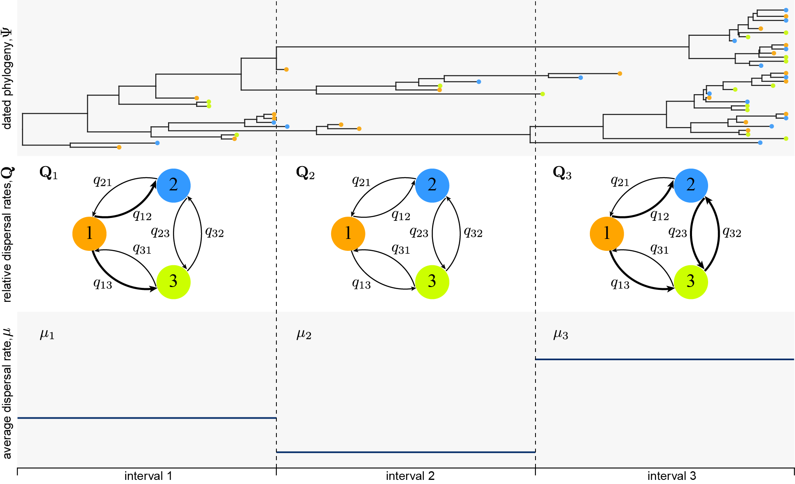

## Interval-Specific Discrete-Geographic Model Tutorial

This tutorial describes how to specify an interval-specific discrete-geographic model (described in ['Gao et al., 2021'](https://www.medrxiv.org/content/10.1101/2021.12.02.21267221v1)) in a BEAST XML file.
This model extends the ['epoch model'](http://beast.community/epoch_models) (interval-specific relative dispersal rates; Bielejec et al., 2014) and ['time dependent rate model'](http://beast.community/time_dependent_rate_model) (interval-specific average dispersal rate; Membrebe et al., 2019) to allow both the relative and average dispersal rates to vary independently across pre-defined time intervals.

Inference and history simulation under this interval-specific model are enabled by implementation extensions came after the latest stable release of BEAST (1.10.4), so a third-party BEAST jar file is provided [here](https://github.com/jsigao/interval_specific_phylodynamic_models_supparchive/blob/master/program/beast.jar) for the usage of this model.
The source code that can be used to compile this BEAST executable is available [here](https://github.com/jsigao/beast-mcmc).
Pull requests containing the implementation extensions that enable this model have been submitted to the BEAST source-code repository; we expect this model to be available in future BEAST stable releases.

This tutorial builds on several other tutorials (['Epoch model tutorial'](http://beast.community/epoch_models), ['Time dependent rate model tutorial'](http://beast.community/time_dependent_rate_model), ['Discrete geographic model tutorial'](http://beast.community/workshop_discrete_diffusion)), and ['Markov Jumps tutorial'](http://beast.community/markov_jumps_rewards)).
In this tutorial we focus on specifying this model and the dispersal-history simulation using this model in a BEAST XML file.
The data used in this type of inference, including sampling time and location (or other types of discrete-trait information) of each sequence, as well as the post-processing and visualization of the output, are identical with any other discrete-geographic inferences using BEAST; details about them are available in the ['Discrete geographic model tutorial'](http://beast.community/workshop_discrete_diffusion)).
An example BEAST XML file that specifies an interval-specific discrete-geographic model (containing all the specific XML blocks we walk through below) is available [here](https://github.com/jsigao/interval_specific_phylodynamic_models_supparchive/blob/master/tutorial/).

### Model
Pathogen dispersal process can be punctuated by events that are likely to impact the average rate of dispersal (e.g., the onset of an international-travel ban) and/or the relative rates of dispersal between pairs of areas (e.g., the initiation of localized mitigation measures).
For example, we imagine a pathogen dispersal history involves two events (e.g., mitigation measures) that define three intervals, where both the relative-dispersal-rates matrix (Q) and average dispersal rare (μ) are impacted by each of these events, such that the interval-specific parameters are (Q1,Q2,Q3) and (μ1,μ2,μ3).

<figure>
    
    <figcaption style='text-align: center'>Figure 1. Interval-specific discrete-geographic model.</figcaption>
</figure>

To specify this interval-specific model in an XML file, we first need to specify the Q matrices.
Let's specify an independent asymmetric Q matrix (with BSSVS) for each time interval.
```xml
  <generalSubstitutionModel id="geography.model.epoch1">
		<generalDataType idref="geography.dataType"/>
		<frequencies>
			<frequencyModel id="geography.frequencyModel.epoch1" normalize="true">
				<generalDataType idref="geography.dataType"/>
				<frequencies>
					<parameter id="geography.frequencies.epoch1" dimension="23"/>
				</frequencies>
			</frequencyModel>
		</frequencies>
		<rates>
			<parameter id="geography.rates.epoch1" dimension="506" value="1.0"/>
		</rates>
		<rateIndicator>
			<parameter id="geography.indicators.epoch1" dimension="506" value="1.0"/>
		</rateIndicator>
	</generalSubstitutionModel>

	<generalSubstitutionModel id="geography.model.epoch2">
		<generalDataType idref="geography.dataType"/>
		<frequencies>
			<frequencyModel id="geography.frequencyModel.epoch2" normalize="true">
				<generalDataType idref="geography.dataType"/>
				<frequencies>
					<parameter id="geography.frequencies.epoch2" dimension="23"/>
				</frequencies>
			</frequencyModel>
		</frequencies>
		<rates>
			<parameter id="geography.rates.epoch2" dimension="506" value="1.0"/>
		</rates>
		<rateIndicator>
			<parameter id="geography.indicators.epoch2" dimension="506" value="1.0"/>
		</rateIndicator>
	</generalSubstitutionModel>
  
  <generalSubstitutionModel id="geography.model.epoch3">
		<generalDataType idref="geography.dataType"/>
		<frequencies>
			<frequencyModel id="geography.frequencyModel.epoch3" normalize="true">
				<generalDataType idref="geography.dataType"/>
				<frequencies>
					<parameter id="geography.frequencies.epoch3" dimension="23"/>
				</frequencies>
			</frequencyModel>
		</frequencies>
		<rates>
			<parameter id="geography.rates.epoch3" dimension="506" value="1.0"/>
		</rates>
		<rateIndicator>
			<parameter id="geography.indicators.epoch3" dimension="506" value="1.0"/>
		</rateIndicator>
	</generalSubstitutionModel>
```

Then the `epochBranchModel` block specifies how these Q matrices distribute over time.
Note that when we want to specify m time intervals, m - 1 `epoch` components should be added into this block;
each `epoch` is associated with a `transitionTime` attribute, specifying the height (amount of time before the most recently sampled tip) of the left (more ancient) boundary of the time interval.
The right (more recent) boundary of each time interval is thus defined by the left boundary of the left adjacent (immediately more ancient) time interval (except the most recent interval whose right boundary height is set to be the same as the most recently sampled tip).
The the dispersal matrix of the most ancient time interval is not put into an `epoch` block; this interval covers all the time more ancient than the greatest `transitionTime`.
```xml
  <epochBranchModel id="geography.epochModel">
    <epoch transitionTime="21">
      <generalSubstitutionModel idref="geography.model.epoch1"/>
    </epoch>
    <epoch transitionTime="42">
      <generalSubstitutionModel idref="geography.model.epoch2"/>
    </epoch>
    <generalSubstitutionModel idref="geography.model.epoch3"/>
    <treeModel idref="treeModel"/>
  </epochBranchModel>
```

We then inform BEAST that this model component will be used as the substitution model across the entire tree by:
```xml
  <siteModel id="geography.siteModel">
		<branchSubstitutionModel>
			<epochBranchModel idref="geography.epochModel"/>
		</branchSubstitutionModel>
	</siteModel>
```

The `rateEpochBranchRates` block specifies how the average dispersal rates vary over time, with the mapping and ordering of these rates identical with those in `epochBranchModel`.
The average dispersal rate of the most ancient time interval is wrapped inside a `rate` block.
```xml
  <rateEpochBranchRates id="geography.epochRates">
    <epoch transitionTime="21">
      <parameter id="geography.clock.rate.epoch1" value="0.01" lower="0.0"/>
    </epoch>
    <epoch transitionTime="42">
      <parameter id="geography.clock.rate.epoch2" value="0.01" lower="0.0"/>
    </epoch>
    <rate>
      <parameter id="geography.clock.rate.epoch3" value="0.01" lower="0.0"/>
    </rate>
  </rateEpochBranchRates>
```

If the root frequency vector is not specified, the stationary distribution of the dispersal matrix of the most ancient interval will be used as the root frequency.
Alternatively, users can also set the root frequency to be uniform or estimate it from data by explicitly specifying a frequency model block.
To estimate the root frequency from data, we also need to add a proposal (later in the `operators` block of the XML file) on this parameter.
```xml
  <frequencyModel id="geography.root.frequencyModel" normalize="true">
    <generalDataType idref="geography.dataType"/>
    <frequencies>
      <parameter id="geography.root.frequencies" dimension="23"/>
    </frequencies>
  </frequencyModel>
```

### Simulating dispersal history
At the end we put the data and all the model components within a `markovJumpsTreeLikelihood` block to tell BEAST how the likelihood will be computed.
The `markovJumpsTreeLikelihood` block also specifies the way how the dispersal history will be performed.
BEAST uses stochastic mapping (specifically, the endpoint-conditioned uniformization algorithm developed by Hobolth and Stone (2009)) to simulate dispersal history over the phylogeny, and a simulation-free algorithm developed by Minin and Suchard (2008a,b) to compute the expected number of dispersal events ('Markov jumps') and the expected time spent in each geographic area ('Markov rewards').
Here we focus on inferring the full dispersal history using the simulation-based stochastic mapping algorithm (as it is unclear to us whether the simulation-free algorithm works expectedly under this interval-specific model).
```xml
  <markovJumpsTreeLikelihood id="geography.treeLikelihood" useAmbiguities="true" useUniformization="true" saveCompleteHistory="true" logCompleteHistory="true" compactHistory="true">
    <attributePatterns idref="geography.pattern"/>
		<treeModel idref="treeModel"/>
		<siteModel idref="geography.siteModel"/>
		<epochBranchModel idref="geography.epochModel"/>
		<rateEpochBranchRates idref="geography.epochRates"/>
    <frequencyModel idref="geography.root.frequencyModel"/>
  </markovJumpsTreeLikelihood>
```
Note that it is essential to set all the listed arguments above (`useUniformization`, `saveCompleteHistory`, `logCompleteHistory`, and `compactHistory`) to be true to simulate the full dispersal history.

As shown below, the `completeHistoryLogger` block tells BEAST to log all the simulated dispersal events into a text file.
If we are also interested in the dispersal history along each specific branch of the phylogeny, we need to add the `markovJumpsTreeLikelihood` object into the `logTree` block so that the simulated dispersal events along each branch will be recorded in the tree output file.
```xml
  <log id="historyLogger" logEvery="2000" fileName="interval_specific_discrete_geographic_model.txt">
		<completeHistoryLogger>
			<markovJumpstreelikelihood idref="geography.treeLikelihood"/>
		</completeHistoryLogger>
	</log>
	<logTree id="treeFileLog" logEvery="2000" nexusFormat="true" fileName="interval_specific_discrete_geographic_model.trees" sortTranslationTable="true">
		<treeModel idref="treeModel"/>
		<markovJumpsTreeLikelihood idref="geography.treeLikelihood"/>
	</logTree>
```

## References
Gao, J., May, M. R., Rannala, B., Moore, B.R. (2021). New Interval-Specific Phylodynamic Models Improve Inference of the Geographic History of Disease Outbreaks. bioRxiv.

F. Bielejec, P. Lemey, G. Baele, A. Rambaut, and M. A. Suchard (2014)) Inferring heterogeneous evolutionary processes through time: from sequence substitution to phylogeography. Syst. Biol. 63(4):493–504.

Membrebe, J. V., Suchard, M. A., Rambaut, A., Baele, G., Lemey, P. (2019) Bayesian inference of evolutionary histories under time-dependent substitution rates. Mol. Biol. Evol. 36(8):1793-1803.

Hobolth A, Stone EA. 2009. Simulation from endpoint- conditioned, continuous-time Markov chains on a finite state space, with applications to molecular evolution. The Annals of Applied Statistics. 3:1204.

Minin VN, Suchard MA. 2008a. Counting labeled transitions in continuous-time Markov models of evolution. Journal of Mathematical Biology 56:391-412.

Minin VN, Suchard MA. 2008b. Fast, accurate and simulation-free stochastic mapping. Philos Trans R Soc Lond B Biol Sci 363:3985-3995.
